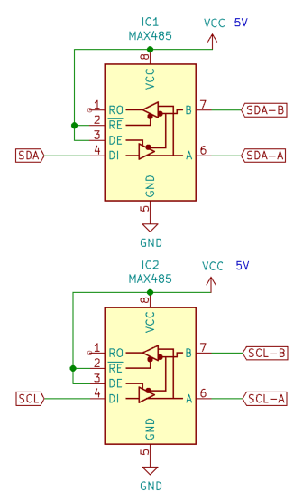

# Brose 22-044-502-020 with VM-IIC controller
I recently got hold of a Brose flipdot display. Naturally I wanted to find out how it works and how to drive it. My efforts of understanding it will be documented in this repo.

The `Alcatel MT 1028 I` ICs seem to be a Brose clone of the FP2800A flipdot drivers.

## Protocol
The Brose Vollmatrix Control with VM-IIC controller has quite a cursed hardware layer.

It uses two RS422 transceivers to transmit the SDA and SCL signal of an I²C bus to all connected displays. Because this method of transmission is inherently unidirictional, it means that you somehow have to ignore the missing ACK from the I²C slaves.

3 bytes are sent via the bus to update 3 PCF8574 I²C port expanders. Connected to those are two FP2800 row drivers located on the VM-IIC controller card and level shifters for signals on the 60 pin header. Those signals are for the FP2800 column drivers and their module select enable signal located on the flipdot modules. The mapping for the port expanders is listed [below](#ic-port-expander-mapping). 

For the correct method of controlling the FP2800 flipdot drivers, look into its [datasheet](doc/fp2800-datasheet.pdf) or at my implementation. Maybe I'll go into more depth in the future™.

### Schematic 
I reverse engineered the most important aspects of the VM-IIC and documented it [here](Brose_VM-IIC_schematic/Brose_VM-IIC_schematic.pdf).

### CPC Plug Pinout
| Pin | Color  | Function |
| --- | ------ | -------- |
| 1   | White  | SDA A    |
| 2   | Brown  | SDA B    |
| 3   | Green  | SCL A    |
| 4   | Yellow | SCL B    |

### Pluggable Screw Terminal on VM-IIC Board
| Pin | Color  | Function |
| --- | ------ | -------- |
| 1   | Red    | 24V      |
| 2   | Blue   | GND      |
| 3   | White  | SDA A    |
| 4   | Brown  | SDA B    |
| 5   | Green  | SCL A    |
| 6   | Yellow | SCL B    |

### I²C Port Expander Mapping
| Address | I²C Bit | Function               |
| ------- | ------- | ---------------------- |
| 0x40    | 0       | Module Select 8        |
|         | 1       | Module Select 7        |
|         | 2       | Module Select 6        |
|         | 3       | Module Select 5        |
|         | 4       | Module Select 4        |
|         | 5       | Module Select 3        |
|         | 6       | Module Select 2        |
|         | 7       | Module Select 1        |
| 0x42    | 0       | N/C                    |
|         | 1       | Column FP2800 B1       |
|         | 2       | Column FP2800 B0       |
|         | 3       | Column FP2800 A2       |
|         | 4       | Column FP2800 A1       |
|         | 5       | Column FP2800 A0       |
|         | 6       | Column FP2800 DATA     |
|         | 7       | Row FP2800 A2          |
| 0x44    | 0       | Row FP2800 A1          |
|         | 1       | Row FP2800 A0          |
|         | 2       | Row FP2800 B1          |
|         | 3       | Row FP2800 B0          |
|         | 4       | Row FP2800 Low DATA    |
|         | 5       | Row FP2800 Low ENABLE  |
|         | 6       | Row FP2800 High DATA   |
|         | 7       | Row FP2800 High ENABLE |

Row Low: 1-14  
Row High: 15-20

### Row Drivers
The VM-IIC board has eight "module select" outputs and uses two FP2800 ICs to control matrix rows. IC1 drives the rows 1 to 14, IC13 controls rows 15-20. That means one VM-IIC board can control up to 8 flipdot panels, each having up to 28x20 pixels.

| Matrix  | FP2800  | Signal |
|-------- |-------- | ----- |
| SET 1   | IC1     | 0A    |
| SET 2   | IC1     | 0B    |
| SET 3   | IC1     | 0C    |
| SET 4   | IC1     | 0D    |
| SET 5   | IC1     | 0E    |
| SET 6   | IC1     | 0F    |
| SET 7   | IC1     | 0G    |
| SET 8   | IC1     | 2A    |
| SET 9   | IC1     | 2B    |
| SET10   | IC1     | 2C    |
| SET11   | IC1     | 2D    |
| SET12   | IC1     | 2E    |
| SET13   | IC1     | 2F    |
| SET14   | IC1     | 2G    |
| SET15   | IC13    | 0A    |
| SET16   | IC13    | 0B    |
| SET17   | IC13    | 0C    |
| SET18   | IC13    | 0D    |
| SET19   | IC13    | 0E    |
| SET20   | IC13    | 0F    |
| RESET 1 | IC1     | 1A    |
| RESET 2 | IC1     | 1B    |
| RESET 3 | IC1     | 1C    |
| RESET 4 | IC1     | 1D    |
| RESET 5 | IC1     | 1E    |
| RESET 6 | IC1     | 1F    |
| RESET 7 | IC1     | 1G    |
| RESET 8 | IC1     | 3A    |
| RESET 9 | IC1     | 3B    |
| RESET10 | IC1     | 3C    |
| RESET11 | IC1     | 3D    |
| RESET12 | IC1     | 3E    |
| RESET13 | IC1     | 3F    |
| RESET14 | IC1     | 3G    |
| RESET15 | IC13    | 1A    |
| RESET16 | IC13    | 1B    |
| RESET17 | IC13    | 1C    |
| RESET18 | IC13    | 1D    |
| RESET19 | IC13    | 1E    |
| RESET20 | IC13    | 1F    |

## RS422 interface

Many hobby projects use microcontrollers like Arduino or ESP2866/ESP32 to control devices. To translate TTL level I²C signals to RS422 you can use for example MAX485 transceiver chips.

